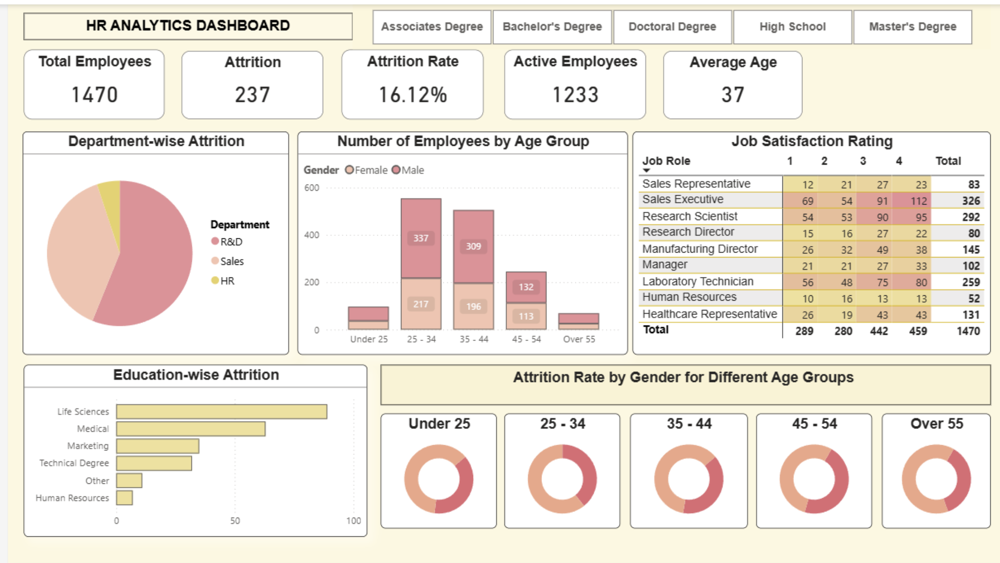

# HR Analytics Dashboard – Employee Attrition Analysis (Power BI)

## Overview
This project presents an interactive HR analytics dashboard built in **Power BI** to analyse employee attrition and workforce satisfaction. The dashboard focuses on identifying patterns in attrition across departments and demographic groups, while providing clear metrics to support HR decision-making.

## Dashboard Preview

## Objectives
- Calculate and monitor **employee attrition** and **attrition rate**
- Analyse attrition by **department**, **gender**, and **job role**
- Explore relationships between **job satisfaction**, **employee satisfaction**, and attrition
- Provide an intuitive, interactive dashboard for HR stakeholders

## Tools & Technologies
- **Power BI Desktop**
- **DAX** (Data Analysis Expressions)
- Data modelling and relationships
- Interactive visualisations and slicers

## Key DAX Measures
- **Total Employees**
- **Attrition Count**
- **Attrition Rate (%)**
- Satisfaction-based aggregations for comparative analysis

These measures are used dynamically across visuals to allow filtering by department, gender, and satisfaction levels.

## Dashboard Features
- KPI cards showing overall attrition and attrition rate
- Department-level attrition comparison
- Gender-based attrition breakdown
- Job satisfaction and employee satisfaction distributions
- Interactive slicers for flexible analysis
- Clean, business-focused dashboard layout

## Key Insights
- Attrition varies significantly across departments
- Certain departments show consistently higher attrition rates
- Differences in attrition are observable across gender groups
- Lower job satisfaction and employee satisfaction are associated with higher attrition

## Use Case
This dashboard demonstrates how HR teams can:
- Identify high-risk departments
- Monitor workforce satisfaction
- Support retention strategies with data-driven insights

## Notes
This project was created for portfolio purposes to demonstrate skills in Power BI, DAX, data visualisation, and analytical storytelling. No sensitive or real employee data is included.
